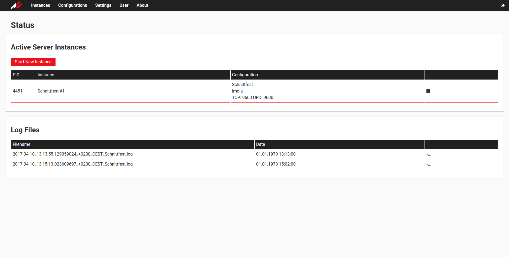
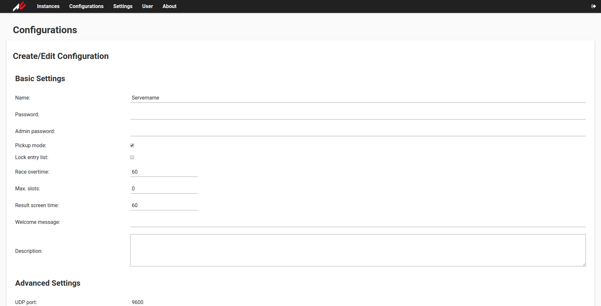
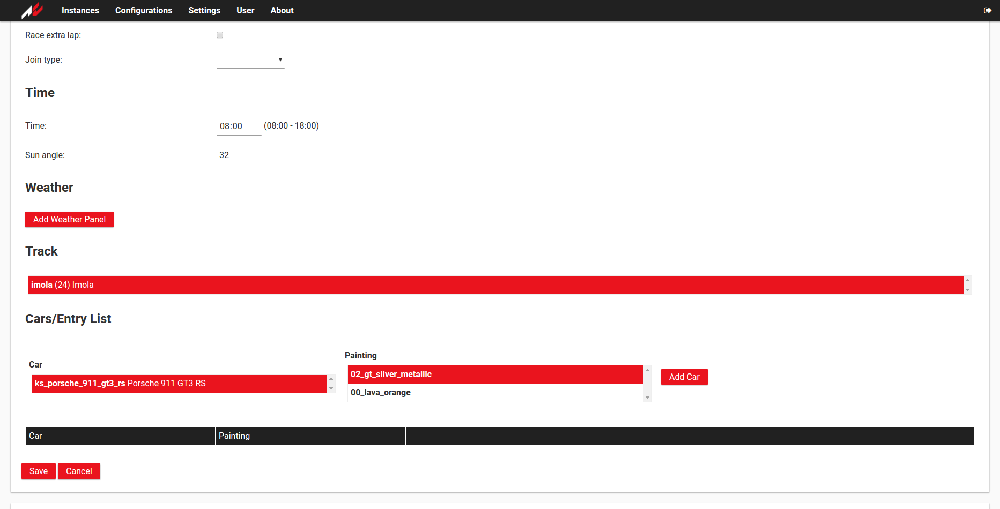
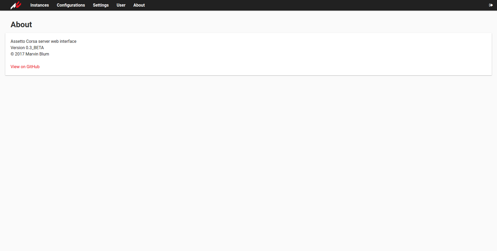

[](https://circleci.com/gh/assetto-corsa-web/acweb)
[](https://goreportcard.com/report/github.com/assetto-corsa-web/acweb)

# Assetto Corsa server web interface

This tool provides monitoring and management for your Assetto Corsa server instances. You can create multiple configuration profiles, start/stop server instances and watch the status of them.

**Screenshots at the bottom of this page!**

## System requirements

* 64bit Linux or Windows server
* MySQL or Postgres database

## Install

Note that the scripts within the main directory are not used to start or install the server. They're for development only and not shipped with the release. Download releases from the [GitHub release page](https://github.com/DeKugelschieber/acweb/releases) instead of the repository. If you find any issues installing the server or bugs, please open an issue in the issue section on GitHub.
These instructions do not provide information on how to install the Assetto Corsa server itself. On Linux, you basically install steam, login to your account and download **the Windows version** of the game, which also includes the Linux binary.

### Install using Docker

The easiest way to install acweb is to use [Docker](https://hub.docker.com/r/kugel/acweb/):

1. install Docker on your (Linux) server
2. pull the latest release:

```
docker pull kugel/acweb
```

3. install MySQL on your server or use a docker image
4. create the database schema (schema/mysql/schema.sql + all migration scripts in appropriate order)
5. start the Docker container (adjust the parameters to your needs):

```
# expose the same port you start the server on: -p PORT:${ACWEB_HOST}
# and the ports used by Assetto Corsa (9600 TCP/UPD and 8081 for example)
sudo docker run -d -p 80:8080 -p 9600:9600/tcp -p 9600:9600/udp -p 8081:8081 --name acweb \
    -e ACWEB_DB_TYPE=mysql \
    -e ACWEB_DB_USER=root \
    -e ACWEB_DB_PASSWORD=password \
    -e ACWEB_DB_HOST="tcp(127.0.0.1:3306)" \
    -e ACWEB_DB=acweb \
    -v /ac/install/path:/ac \
    -v /log/dir/path:/logs \
    kugel/acweb

# make sure its running
sudo docker ps acweb
```

This will use a MySQL database installed on your host machine. To use a MySQL database running in a container, please rever to the official [MySQL image](https://hub.docker.com/_/mysql/). You have to use Dockers --link option to access it, if you don't expose the MySQL port. Alternatively you can use Postgres.
To start the server, you can also use a [docker-compose file](https://docs.docker.com/compose/). I recommend to enable SSL using [letsencrypt](https://letsencrypt.org/) and a reverse proxy.
To run server instances, you need to mount the Assetto Corsa installation directory (containing the binary) to /ac. In the UI set the execution path (Settings -> AC server folder) to /ac. To save the instance logs outside the Docker container, you can mount /instance_logs.

### Manual installation

This instruction supposes you to use Linux. On Windows you basically need to perform the same steps. You need a MySQL database and rights to upload and execute applications. I recommend to create a user for your web interface installation.

1. download the latest release of acweb
2. upload it to your server and unzip it
3. create the database schema (schema/mysql/schema.sql + all migration scripts in appropriate order)
4. set the environment variables to configure your server:

```
# acweb host, to make it accessible from the outside use 0.0.0.0:PORT
export ACWEB_HOST=localhost:8080

# optional log file location (will be created if it doesn't exist)
export ACWEB_LOGDIR=

# optional log level (debug, info or empty for warnings and higher)
export ACWEB_LOGLEVEL=info

# log directory for server instances, must be set
export ACWEB_INSTANCE_LOGDIR=instance_logs

# config file directory for tracks.json and cars.json, default is configs (config for Docker)
export ACWEB_CONFIG_DIR=configs

# path to TLS private key file
export ACWEB_TLS_PRIVATE_KEY=

# path to TLS cert file
export ACWEB_TLS_CERT=

# database type mysql or postgres, default is mysql
export ACWEB_DB_TYPE=mysql

# database user
export ACWEB_DB_USER=root

# database password
export ACWEB_DB_PASSWORD=

# database host (most likely tcp(localhost:3306))
export ACWEB_DB_HOST=

# database name:
export ACWEB_DB=acweb

# additional variables for postgres only:
export ACWEB_DB_PORT=5432
export ACWEB_DB_SSLMODE=disable
export ACWEB_DB_SSL_CERT=
export ACWEB_DB_SSL_KEY=
export ACWEB_DB_ROOT_CERT=
```

5. start it ./acweb
6. you can now visit your web interface

## Updating

1. download the latest release
2. upload it to your server and unzip it
3. update your MySQL database (migration scripts can be found in schema/mysql mig_FROMVERSION_TOVERSION.sql)
4. start it

For Docker pull the latest release, execute the migration script(s) and start it.

## Login

On first startup, acweb creates a default user called "root" with password "root". **Please change the password right after your first login!**

## Adding tracks and cars

To add tracks and cars, from a mod for instance, you must add them to the cars.json and tracks.json configuration files to make them appear in the web interface:

```
[
    // a track
    {
        "name": "NAME",
        "config": "CONFIG_TRACK",
        "description": "Name",
        "max_slots": NUMBER_OF_SLOTS
    },
    // ...
```

```
[
    // a car
    {
        "name": "CAR_NAME",
        "description": "Car Name",
        "paintings": [
            "SKIN_0",
            "SKIN_1",
            // ...
        ]
    },
    // ...
```

The files can be found within the configs directory. To modify them using Docker, mount a volume to /config and copy the original files into it, then modify them.

## Contribute

To contribute please open issues and pull requests. The frontend is build using VueJs, [minvue](https://github.com/DeKugelschieber/vuejs-minify) and sass. The backend is build on Go (golang) and MySQL. For details please view the provided scripts within the main directory.

All Go code must be run through go fmt. The frontend and backend changes must be (manually) tested on your system. If you have issues running it locally open an issue. Unit tests are not required yet, but that's something I'll may add in the future.

### Contributors (alphabetical)

macedot, vinyii

## Links

* [Docker Hub](https://hub.docker.com/r/kugel/acweb/)
* [Assetto Corsa Forums](http://www.assettocorsa.net/forum/index.php?threads/ac-server-web-interface.44582)
* [Spieleprogrammierer.de](https://www.spieleprogrammierer.de/12-projektvorstellungen-und-stellenangebote/26396-tool-assetto-corsa-server-web-interface/?highlight=)

## License

MIT

## Screenshots







